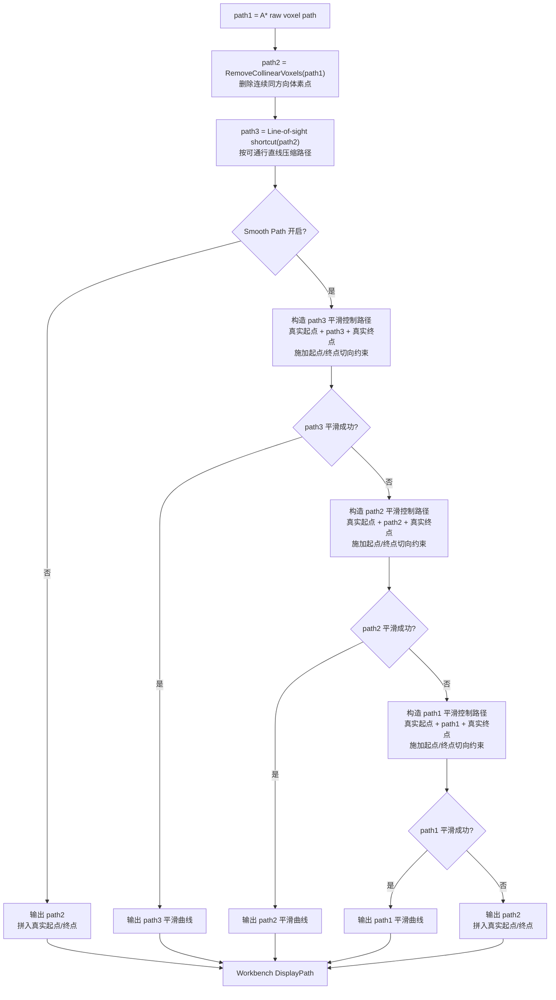

# 路径优化与平滑流程

本文记录当前体素路径规划在 A* 搜索成功之后的处理流程，范围从 `VoxelAStarResult::voxelPath` 开始，到 Workbench 中最终显示的路径结束。

## 总体流程



## A* 之后的路径

A* 的输出是体素索引序列，记为 `path1`，对应 `astarResult.voxelPath`。该路径已经满足当前搜索模式的可通行约束，但它通常包含很多相邻体素点，不适合直接作为曲线控制点。

后处理首先执行：

- `path2 = RemoveCollinearVoxels(path1)`：删除连续同方向移动中的中间体素点。
- `path3 = Line-of-sight shortcut(path2)`：尝试从当前体素直接连到更远体素；直连必须通过 `IsLineWalkable` 校验。
- `shortcutTurnPenalty`：当配置了转弯惩罚时，shortcut 不再总是选择最远可直连点，而会综合入口/出口转向严重程度。

## 平滑输出规则

当前按 `Smooth Path` 开关分两类输出：

- 未开启 `Smooth Path`：输出 `path2`，并拼入界面真实起点/终点。
- 开启 `Smooth Path`：必须先尝试输出平滑曲线；只有所有平滑尝试失败时，才输出 `path2`，并拼入真实起点/终点。

开启 `Smooth Path` 后的尝试顺序：

1. 构造 `真实起点 + path3 + 真实终点` 的平滑控制路径，并施加起点/终点切向约束，拟合平滑曲线。
2. 如果失败，构造 `真实起点 + path2 + 真实终点` 的平滑控制路径，并施加起点/终点切向约束，拟合平滑曲线。
3. 如果仍失败，构造 `真实起点 + path1 + 真实终点` 的平滑控制路径，并施加起点/终点切向约束，拟合平滑曲线。
4. 如果最终仍失败，输出 `path2 + 真实起点/终点`。

这里的“构造平滑控制路径”发生在平滑之前，不是先对 `pathN` 平滑后再把真实端点接回去。真实起点和真实终点必须作为平滑曲线的两端点参与计算。

## 真实端点与端点方向

A* 搜索使用的是吸附到可通行体素附近的端点。最终显示和平滑阶段需要回到界面给定的真实起点/终点。

平滑 control path 处理规则：

- 若启用 `useRealEndpointsForSmoothing`，control path 从真实起点开始，到真实终点结束。
- 起点切向由 `startDirection` 约束。
- 终点切向按 `goalDirection` 的反向约束。
- 真实端点附近可能位于有交体素中，因此采样点距离任一端点小于 `endpointCollisionExemptRadius` 时，不做有交体素检测，但仍检查禁行半空间。

注意：端点 guide distance 只作为端点附近 A* 点过滤尺度，不作为 Catmull-Rom 的实际控制点。

## 平滑生成与校验

启用 `Smooth path` 后，优化器按上述顺序对候选路径尝试生成平滑结果。

当前曲线生成方式：

- 优先使用 centripetal Catmull-Rom 生成采样点。
- 也会尝试不同强度的 Chaikin 平滑作为备选。
- Catmull-Rom 是插值曲线，会经过 control path 中的点，因此 control path 点数和位置会明显影响曲线形态。

平滑结果必须通过 `ValidateSmoothedPath`：

- 每个采样点不能位于禁行半空间。
- 除端点豁免半径内的点外，采样点不能位于有交体素。
- 相邻采样点之间的线段也要做分段采样碰撞检查。
- 如果配置了 `maxCurveDeviation`，采样点不能过度偏离原 control polyline。

## 平滑内部选择

外层不再对多条 control path 做综合评分竞争。这样可以避免起终点轻微变化时，不同候选互相切换导致路径形态跳变。

单条 control path 内部仍会尝试不同平滑方式，并选择局部效果更好的有效结果：

| 指标 | 目的 |
|---|---|
| Catmull-Rom | 生成经过控制点的主平滑曲线 |
| Chaikin | 在 Catmull-Rom 校验失败或转角较差时作为备选 |
| 最大方向变化 | 在有效候选中优先选择局部急弯更小的结果 |

所有候选仍必须通过 `ValidateSmoothedPath`。当前外层 control path 选择按固定顺序执行，不使用多候选综合评分来决定最终路径。

## 代码职责

平滑相关代码按“生成候选”和“接受结果”拆分，避免在尝试阶段直接改写最终结果。

| 函数 | 职责 |
|---|---|
| `BuildSmoothingControlPath` | 将 `path2/path3` 的体素中心路径转换为平滑控制路径，并按需拼入真实起点/终点。 |
| `SmoothPointPath` | 对候选路径尝试 Catmull-Rom 与 Chaikin 候选，并返回通过校验的最佳采样路径。 |
| `TryBuildSmoothedCandidate` | 只构造并校验一个平滑候选，不写入 `VoxelPathOptimizeResult`。 |
| `AcceptSmoothedCandidate` | 在候选成功后统一写入 `voxelPath`、`pointPath`、`displayPointPath`、`controlPointPath` 和 `smoothingSucceeded`。 |
| `ValidateSmoothedPath` | 对平滑采样点和采样段做禁行区域、有交体素、最大偏离检查。 |

`displayPointPath` 始终来自实际通过校验的 smoothed path。界面显示不会再根据 control path 重新生成另一条曲线。

## 最终显示路径

优化器输出后，`VoxelPathPlanner` 选择显示路径来源：

```text
displaySource =
    optResult.displayPointPath 非空 ? optResult.displayPointPath
                                  : optResult.pointPath
```

随后执行 `BuildDisplayPathPoints(displaySource, realStart, realGoal)`，确保 Workbench 显示路径从界面真实起点开始，并在界面真实终点结束。

Workbench 显示逻辑：

- `DisplayPath` 显示 `result.displayPathPoints`，该路径必须已经拼入真实起点/终点。
- 可选显示 A* 搜索点集，来自 `result.astarResult.pointPath`。
- 可选显示平滑控制点，来自 `result.optimizeResult.controlPointPath`。
- 路径体素 overlay 使用最终路径对应的体素状态，按 free / clearance / occupied 分色显示。

## 当前关键约束

- A* 负责离散拓扑可达性。
- `path2` 是未平滑输出路径，也是平滑失败后的最终兜底输出。
- `path3` 是开启平滑后优先尝试的主控制路径。
- `path1` 只在 `path3` 和 `path2` 平滑都失败后作为最后的平滑尝试来源。
- 平滑负责改善曲线形态，但不能穿过有交体素或禁行区域。
- 真实起点/终点优先用于最终几何显示和端点切向约束。
- Workbench 显示使用实际通过校验的 smoothed 路径，不再重新从 control path 生成另一条显示曲线。
