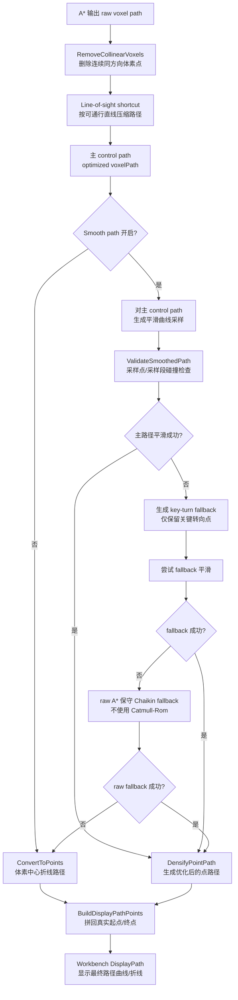

# 路径优化与平滑流程

本文记录当前体素路径规划在 A* 搜索成功之后的处理流程，范围从 `VoxelAStarResult::voxelPath` 开始，到 Workbench 中最终显示的路径结束。

## 总体流程



## A* 之后的路径

A* 的输出是体素索引序列，记录在 `astarResult.voxelPath`。该路径已经满足当前搜索模式的可通行约束，但它通常包含很多相邻体素点，不适合直接作为曲线控制点。

后处理首先执行：

- `RemoveCollinearVoxels`：删除连续同方向移动中的中间体素点。
- `Line-of-sight shortcut`：尝试从当前体素直接连到更远体素；直连必须通过 `IsLineWalkable` 校验。
- `shortcutTurnPenalty`：当配置了转弯惩罚时，shortcut 不再总是选择最远可直连点，而会综合入口/出口转向严重程度。

## 平滑控制路径来源

当前平滑阶段采用确定性顺序，而不是让多个候选同时评分竞争。

默认 control path 是 `optimized voxelPath`：

- A* 原始路径先经过 `RemoveCollinearVoxels`。
- 再经过一次主 `Line-of-sight shortcut`。
- 平滑优先只使用该 shortcut 后的路径。

只有当主 control path 的平滑结果没有通过校验时，才启用 `key-turn path` 作为 fallback。

`key-turn path` 的提取规则：

- 保留起点和终点。
- 相邻体素以点或边连接时，保留对应位置作为关键点。
- 即使是面连接，只要前后移动方向发生变化，也保留为关键点。
- 两个关键点之间仍做 `IsLineWalkable` 校验；若直连失败，则回补该区间内的原始体素点。

该 fallback 的目标是：主 shortcut 路径过稀导致平滑失败时，提供一个仍然较稀疏、但保留必要拓扑转角的备选路径。

如果 `key-turn path` 仍然平滑失败，最后会使用 raw A* 路径做保守 Chaikin fallback。该兜底不使用 Catmull-Rom，避免完整 raw A* 路径被插值曲线逐点穿过后退化成沿 A* 折线摆动的曲线。

## 真实端点与端点方向

A* 搜索使用的是吸附到可通行体素附近的端点。最终显示和平滑阶段需要回到界面给定的真实起点/终点。

平滑 control path 处理规则：

- 若启用 `useRealEndpointsForSmoothing`，control path 从真实起点开始，到真实终点结束。
- 起点切向由 `startDirection` 约束。
- 终点切向按 `goalDirection` 的反向约束。
- 真实端点附近可能位于有交体素中，因此采样点距离任一端点小于 `endpointCollisionExemptRadius` 时，不做有交体素检测，但仍检查禁行半空间。

注意：端点 guide distance 只作为端点附近 A* 点过滤尺度，不作为 Catmull-Rom 的实际控制点。

## 平滑生成与校验

启用 `Smooth path` 后，优化器先对主 control path 尝试生成平滑结果；主路径失败时才尝试 `key-turn path` fallback；如果仍失败，再对 raw A* 路径做保守 Chaikin fallback。

当前曲线生成方式：

- 优先使用 centripetal Catmull-Rom 生成采样点。
- 也会尝试不同强度的 Chaikin 平滑作为备选。
- Catmull-Rom 是插值曲线，会经过 control path 中的点，因此 control path 点数和位置会明显影响曲线形态。

平滑结果必须通过 `ValidateSmoothedPath`：

- 每个采样点不能位于禁行半空间。
- 除端点豁免半径内的点外，采样点不能位于有交体素。
- 相邻采样点之间的线段也要做分段采样碰撞检查。
- 如果配置了 `maxCurveDeviation`，采样点不能过度偏离原 control polyline。

## 平滑内部选择

外层不再对多条 control path 做综合评分竞争。这样可以避免起终点轻微变化时，不同候选互相切换导致路径形态跳变。

单条 control path 内部仍会尝试不同平滑方式，并选择局部效果更好的有效结果：

| 指标 | 目的 |
|---|---|
| Catmull-Rom | 生成经过控制点的主平滑曲线 |
| Chaikin | 在 Catmull-Rom 校验失败或转角较差时作为备选 |
| 最大方向变化 | 在有效候选中优先选择局部急弯更小的结果 |

raw A* fallback 只使用保守 Chaikin 候选，不使用 Catmull-Rom。所有候选仍必须通过 `ValidateSmoothedPath`。

以下平滑评分权重仍保留为参数，但当前外层 control path 选择已改为确定性 fallback 流程：

- `smoothingSignificantTurnWeight`
- `smoothingTotalTurnWeight`
- `smoothingMaxTurnWeight`
- `smoothingDetourWeight`

## 最终显示路径

优化器输出后，`VoxelPathPlanner` 选择显示路径来源：

```text
displaySource =
    optResult.displayPointPath 非空 ? optResult.displayPointPath
                                  : optResult.pointPath
```

随后执行 `BuildDisplayPathPoints(displaySource, realStart, realGoal)`，确保 Workbench 显示路径从界面真实起点开始，并在界面真实终点结束。

Workbench 显示逻辑：

- `DisplayPath` 显示 `result.displayPathPoints`。
- 可选显示 A* 搜索点集，来自 `result.astarResult.pointPath`。
- 可选显示平滑控制点，来自 `result.optimizeResult.controlPointPath`。
- 路径体素 overlay 使用最终路径对应的体素状态，按 free / clearance / occupied 分色显示。

## 当前关键约束

- A* 负责离散拓扑可达性。
- shortcut 负责生成默认平滑控制路径。
- key-turn path 只在默认控制路径平滑失败时作为受限 fallback。
- raw A* 路径只作为最后的保守 Chaikin fallback，不作为 Catmull-Rom 控制路径。
- 平滑负责改善曲线形态，但不能穿过有交体素或禁行区域。
- 真实起点/终点优先用于最终几何显示和端点切向约束。
- Workbench 显示使用实际通过校验的 smoothed 路径，不再重新从 control path 生成另一条显示曲线。
